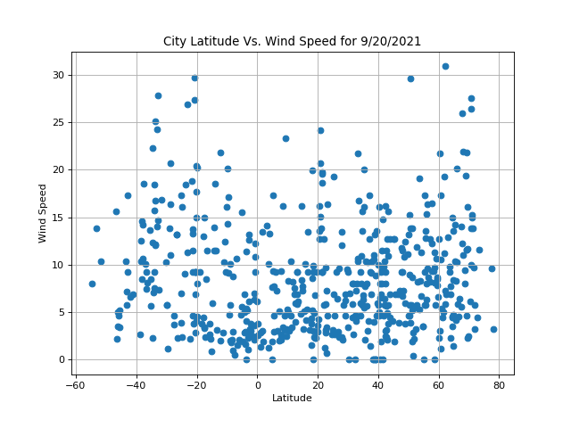

# python-api-challenge

* In this project, OpenWeatherMap API is used answer questions about how weather across the globe is affected by distance from the equator. Citipy is used to find the nearest city to randomly generated latitudes and longitudes, for 500+ cities across the globe. 

* The following relationships are illustrated, based on the random selection of cities:
    * Temperature (F) vs. Latitude
    * Humidity (%) vs. Latitude
    * Cloudiness (%) vs. Latitude
    * ind Speed (mph) vs. Latitude
    * Each of the following for both northern and southern hemispheres:
        * Temperature (F) vs. Latitude
        * Humidity (%) vs. Latitude
        * Cloudiness (%) vs. Latitude
        * Wind Speed (mph) vs. Latitude

* Also in this project, Google Places API is used to generate a heat map of humidity for the random selection of cities. 

* Lastly, from the random selection of cities, only the cities that meet certain requirements (listed below) are located with markers on a map, using gmaps, along with the name of the nearest hotel name.
    * Requirements: 
        * Maximum low temp= 72F
        * Maximum high temp = 79F
        * Maximum wind speed = 10 MPH
        * Maximum cloudiness = 0%

* The following three observations were made about the weather across the globe:
    * Cities with close to the equator have higher Maximum Temperatures.

    * Cities close to the equator tend to have high cloudiness percentages.

    * Cities near the euqator tend to have lower wind speeds than cities in the northern and southern hemispheres.
